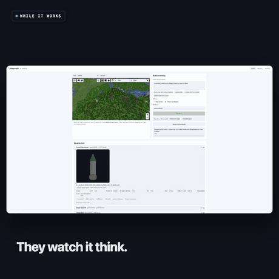
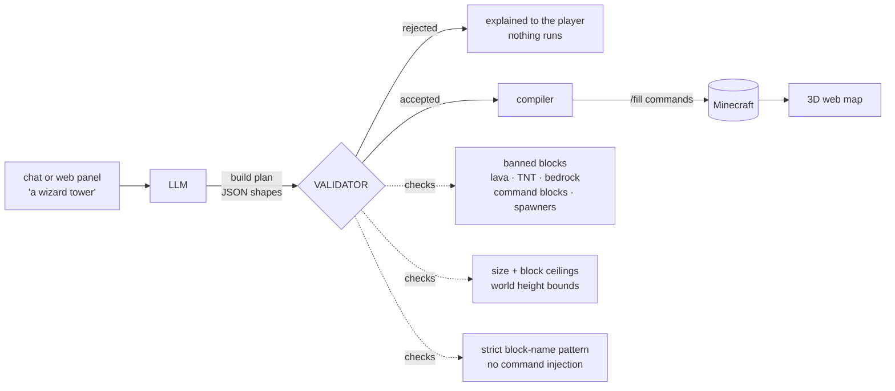

# Minecraft AI Build Server

Your kid wants a Minecraft server. Running one means SSH, port forwards and a
whitelist — so every "can my friend join?" becomes a support ticket for you, and
every "can you build me a castle?" is an hour of your evening.

This is that server, built so they can run it themselves: a web panel for adding
friends and making worlds, a 3D map of the world in the browser, and an AI that
builds things when they ask — from in-game chat or by pointing at the map.

Java **and** Bedrock (iPad, console, Switch) players join the same world.



## What it does

In game, anyone types:

```text
!build a wizard tower with a spiral staircase
!undo
```

In the browser: move the map, describe what you want, press **Build it**. Watch
the phase and the fill count while it works. Add a friend to the whitelist in ten
seconds. Create a new world from a dropdown, and set its game mode.

Real output from a build:

```text
Round Watchtower — A cozy round stone tower with a pointy roof and a door to peek from!
2,757 blocks · 15×32×15 · 12s · 0.6p · at -1250, 71, 1250
```

From about **half a penny** for a small build to **5p** for a 200,000-block
castle, using Kimi K2.6 via OpenRouter. It also runs against a local model for
free.

Every build keeps a record you can open: the exact words that were typed, the
blocks, the size, how many shapes became how many `/fill`s, what it cost, and a
**picture drawn from the block data itself** — so the history is a gallery, not a
list of numbers.

| | |
|---|---|
| **Where** | *Show me on the map* flies the 3D map to it; *Teleport me there* puts the player on top of it |
| **The world** | Day · Night · Clear skies · Rain, one button each |
| **Worlds** | Each gets its own game mode — a creative world for building, survival for playing |
| **By hand** | WorldEdit is installed, so they can reshape whatever the AI puts down |

## Why it's safe to point an LLM at your kid's world

The model **never emits a command that gets executed**. It returns an abstract
*build plan* — a list of shapes — which is validated, and only then compiled into
`/fill` commands. The model proposes; the validator disposes.



A hallucinating — or prompt-injected — model can at worst produce a plan that
gets rejected. Limits live in `.env`: 400,000 blocks, 120 per axis, 400 shapes,
20 builds/hour per player, 60/hour server-wide, and a daily spend ceiling read
from the API's own reported cost. Lava, fire and TNT are behind a single
`ALLOW_HAZARD_BLOCKS` switch, off by default.

**Taste is not enforced in code.** An earlier version rejected plans it judged
drab, and spent its time refusing a white yacht for being white and a black
volcano for being black. Style guidance belongs in the system prompt; the
validator only decides what is *safe*.

### Putting it on the ground

Finding the surface by searching down from the sky lands you on the tree canopy,
which is how builds end up floating over a forest. The probe walks down through
leaves, logs, vines and snow until it hits real ground, and the footprint is
measured across all nine corners rather than the centre alone. Trees standing
inside the footprint are cleared *after* the undo snapshot is taken, so undo puts
the wood back.

### Undo that actually restores

Before each build the target region is photocopied with vanilla `/clone` into a
far-away vault, one slot per player. `!undo` copies it back — restoring terrain
*and* anything already standing there.

CoreProtect can't do this job: it logs *player events*, and `/fill` over RCON
fires none. It stays for what it's good at — rolling back griefing by real
players.

## Quick start

```bash
git clone https://github.com/jhammant/minecraft-ai-build-server
cd minecraft-ai-build-server
cp .env.example .env
# set: RCON_PASSWORD (openssl rand -base64 24)
#      OPENROUTER_API_KEY
#      MC_OPS  - your Minecraft username
docker compose up -d
```

- **Game:** `<your-host>` (Java) or `<your-host>:19132` (Bedrock)
- **Panel:** `http://<your-host>:8080` — no password on your own LAN

Needs Docker and about **5 GB of RAM** for the Minecraft container. Any
always-on box will do — an old laptop, a Mini PC, a NAS.

## Letting your kid run it

They go in a LuckPerms group with exactly `minecraft.command.whitelist` plus the
Multiverse world commands — **not** op, so no `/ban`, `/stop` or `/gamemode`:

```bash
./scripts/mc cmd "lp user <KidName> parent add builder"
```

Now they add their own friends with `/whitelist add <name>`, and you're out of
the loop. See [docs/ACCESS.md](docs/ACCESS.md) for the whitelist model and
exposing the server safely.

## Admin CLI

```bash
./scripts/mc status                  # containers + who's online
./scripts/mc whitelist add <name>
./scripts/mc world add sky flat
./scripts/mc logs ai                 # follow the AI builder
./scripts/mc test                    # end-to-end smoke test
```

## Tests

```bash
cd ai-builder && npm test    # 49 unit: geometry, validator, network trust
./scripts/mc test            # 13 end-to-end against a live server
```

The unit tests cover the security cases directly: command injection through
block names, banned blocks hiding behind a `minecraft:` prefix, size limits
enforced against real compiled geometry rather than what a plan claims about
itself, and a public client spoofing `X-Forwarded-For` to look local.

## Notes from building this

Things that cost real time:

- **Turn reasoning off.** Kimi is a reasoning model and spent ~2 minutes
  deliberating over a fully-specified JSON shape. `reasoning: {enabled: false}`
  cut it to seconds at a fraction of the tokens.
- **OpenRouter routes one model to different providers**, and they don't behave
  identically — with `response_format` set, one leaked its reasoning trace into
  the content field and truncated. Send `provider: {require_parameters: true}`
  and parse defensively.
- **`forceload` doesn't load chunks synchronously.** Clone too early and it
  succeeds *loudly* while copying the wrong blocks. Poll `execute if loaded`.
- **Reading a block over RCON:** `execute if block … run say X` tells you
  nothing — `/say` goes to chat, not command output. Drop the `run` clause and a
  bare `execute if block` answers `Test passed` / `Test failed`.
- **The `hidden` attribute is only a user-agent rule.** Any class setting
  `display` silently overrides it — which left a login panel permanently on
  screen while every server-side test passed. `curl` cannot see CSS.
- **An empty map usually means an empty world.** Minecraft only generates
  terrain as players walk into it; pre-generate with Chunky before blaming the
  renderer.
- **Shapes, not blocks.** A castle is ~50 shapes but ~200,000 blocks. Asking for
  shapes keeps responses small and, crucially, checkable.
- **Vertical extrusion.** A 30-block tower costs the same number of commands as
  a 1-block ring: compute the 2D cross-section once, extrude it.
- **The top of a forest is not the ground.** A binary search from the sky stops
  at the first non-air block, and in a forest that is the canopy — so builds sat
  on the treetops. Walk down through the foliage before deciding where the floor
  is.
- **Don't let a quality heuristic block the user.** A rule that scored palettes
  and rejected "drab" plans looked reasonable and was wrong often enough to make
  the product feel broken — every rejection costs another slow round trip. Safety
  checks are hard; taste is a prompt.
- **Photograph the data, not the world.** Screenshotting builds meant flying a
  camera blind through a URL, and most shots landed inside a wall. Rendering the
  plan directly — isometric, straight from the spans — is faster, always framed,
  and needs no game running. The PNG encoder is 50 lines on `node:zlib`.

## Version pinning

Pinned to Minecraft **26.1.2** rather than 26.2, because CoreProtect has no 26.2
build yet; ViaVersion lets newer clients connect anyway. Minecraft 26.1+ requires
**Java 25** and won't start on 21.

## Stack

Paper · Multiverse-Core · LuckPerms · CoreProtect · Geyser + Floodgate ·
ViaVersion · BlueMap · Chunky · WorldEdit. The builder is plain Node with **zero npm
dependencies** — RCON, the web panel and the LLM calls are all implemented
directly.

## Licence

MIT — see [LICENSE](LICENSE).
